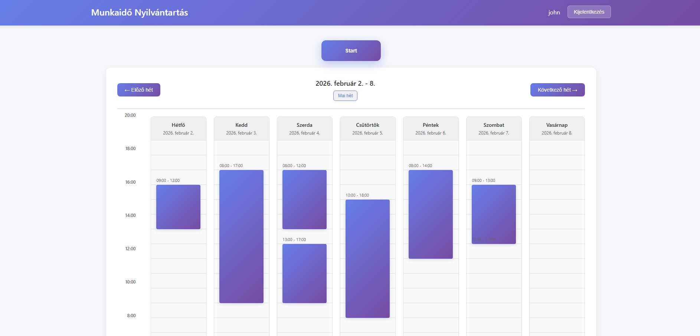

# Beadandó projekt — Szoftverfejlesztési módszertanok (2025)

Rövid leírás
------------
Ez a repozitórium a Szoftverfejlesztési módszertanok tárgyhoz készült csapatbeadandó projekt forráskódját tartalmazza. A projekt célja: Csapatban dolgozva fejleszteni egy webes appot (backend + frontend), ezáltal fejleszteni kommunikációs és fejlesztői készségeket egyaránt. Valamint megismerni a verziókezelő rendszer által nyújtott előnyöket.

Overview
--------

[More screenshots](docs/img/screenshots.md)

Gyors kezdés
------------
Előfeltételek:
- Python 3.8+ telepítve
- Git
- (opcionálisan) virtuális környezet-kezelő

Példa telepítés (Linux/macOS):
```bash
git clone https://github.com/ZahariBalint/szoftverfejlesztes2025.git
cd szoftverfejlesztes2025
python -m venv venv
source venv/bin/activate
pip install -r requirements.txt
```

Windows (PowerShell):
```powershell
git clone https://github.com/ZahariBalint/szoftverfejlesztes2025.git
cd szoftverfejlesztes2025
python -m venv venv
.\venv\Scripts\Activate.ps1
pip install -r requirements.txt
```

Futtatás
--------
A projekt konkrét belépési pontja:
```
python run.py
```

Javasolt fájl- és könyvtárstruktúra
----------------------------------
- src/ vagy app/ — forráskód
- app/tests/ — egységtesztek (pytest)
- static/ - template-ek,JS,CSS
- requirements.txt — függőségek
- README.md — ez a fájl
- .gitignore
- docs/ — (opcionális) dokumentáció

Fejlesztési workflow
-------------------
- Branchelés: használjatok feature branch-eket (pl. `feature/uj-funkcio`).
- Pull request: minden változtatást PR-en keresztül hozzatok be a `master` ágba, és kérjetek review-t csapattársaktól.
- Commit üzenetek: törekedjetek rövid, érthető commit üzenetekre

Tesztelés
--------
Ha használtok pytest-et:
```bash
pip install -r requirements.txt
pytest
```
Adjatok hozzá CI lépéseket (GitHub Actions) a tesztek automatikus futtatásához a PR-eknél.

Hozzájárulás
-----------
1. Fork-old a repót.
2. Készíts feature brancht.
3. Implementáld a változtatásokat, írj teszteket.
4. Nyiss pull request-et a `master` branchre, részletes leírással.

Módosítások a README-ben
------------------------
Frissítsd a README-t a következőkkel, amikor pontos információ rendelkezésre áll:
- pontos belépési parancs
- valós függőségek a requirements.txt fájlban
- csapattagok listája és szerepek
- tesztelési útmutató részletei
